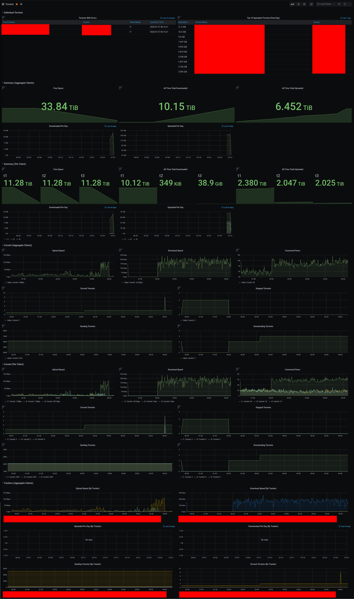

# Transmission InfluxDB Metrics Exporter

This is program scrapes statistics from running [transmission](https://transmissionbt.com/) torrent daemon(s), and inserts them into InfluxDB.

This allows for querying of transmission time-series statistics for use with applications such as dashboards.

## Configuration

A file called `config.json` must be present in the working directory of the program when running.

An example configuration:

```javascript
{
  "seconds_between_collections": 60,  // time to wait between finished transmission scrapes
  "influxdb": {
    "host_addr": "influxdb.remote.host.or.ip",
    "host_port": 8086,
    "use_ssl": false,
    "verify_ssl": false,
    "database": "transmission",  // database will be created if it doesn't exist (don't change if using provided grafana dashboard)
    "username": "root",  // if authentication is disabled on influxdb, leave user/pass as-is
    "password": "root"
  },
  "transmission_clients": [  // Specify as many as desired
    {
      "name": "transmission",  // The name used to tag db datapoints with for this transmission daemon. Useful to make unique when you have more than one client
      "rpc_addr": "transmission.remote.host.or.ip",
      "rpc_port": 9091,
      "rpc_path": "/transmission/rpc",
      "rpc_user": "user",
      "rpc_password": "someRPCpasswordFromTransmissionDaemon",
      "rpc_verified_tls": false,  // note that unverified ssl/tls (such as with self-signed cert) is not currently supported
      "rpc_timeout": 60,  // how long to allow an RPC request to take before timing out with an error
    }
  ]
}
```

## Running

### Requirements

In order to run this, there are different requirements for the local machine running this and the (potentially) remote machine running the torrent daemon and influxdb.

- Remote Machine
  - Running transmission daemon (only version 3.00+) accessible over the network with the specified RPC options in the config.
  - Running [influxdb](https://www.influxdata.com/time-series-platform/) 1.X instance accessible over the network with the specified options in the config. Must have flux _and_ influxql enabled.
  - Note: The transmission daemon and db can be on the same (or different) machines.
- Local Machine (with Docker)
  - No additional requirements. See below if you do not wish to use docker.
- Local Machine (without Docker)
  - Python 3.6+ with the packages from `requirements.txt` installed (`python3 -m pip install -r requirements.txt`)
  - This _should_ be able to be ran on windows or any unix system, but only tested on linux.
    (If there are bugs running this on another OS, please report them)

### Starting

If using docker, simply run the container, mounting your desired config.json into `/usr/src/app/config.json`, and any other necessary directories.

i.e. `docker run -v $(pwd)/config.json:/usr/src/app/config.json cheeseandcereal/transmission_influxdb_exporter:latest`

If not using docker, download the source code here, ensure the above requirements are met,
create and ensure you have a config.json in your working directory,
then start the program with `python3 -m transmission_influxdb.main` in a terminal of some sort.
(`python3` may need to be replaced with `python` depening on how it was installed).

#### Systemd Example Service

The following is an example systemd service file if running on linux with systemd and not docker.

```systemd
[Unit]
Description=Transmission InfluxDB Metrics Exporter
After=network-online.target

[Service]
# Set unbuffered so logging works when running under systemd
Environment="PYTHONUNBUFFERED=true"
WorkingDirectory=/directory/of/code/with/configjson/
ExecStart=/usr/bin/python3 -m transmission_influxdb.main
Restart=always
RestartSec=30

[Install]
WantedBy=default.target
```

## Grafana Dashboard

Check the [grafana](grafana/) folder for a dashboard with many pre-built components.

I recommend you start with this dashboard and remove the components you do not want, and rearrange the remaining ones.

### Dashboard Requirements

In order to use this dashboard, you must have grafana 7.1+ with influxDB configured as a datasource ***with the flux query language*** (not influxql).

### Screenshot


